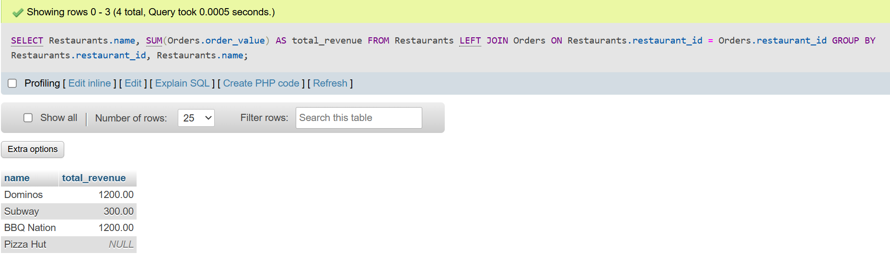
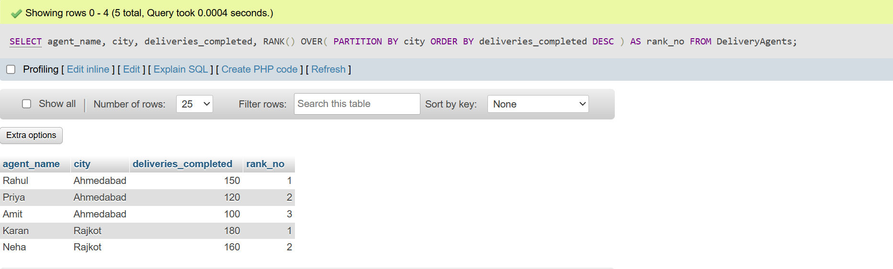
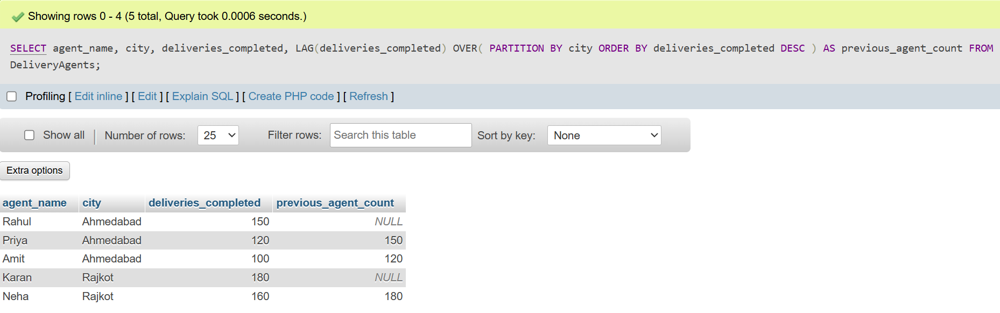
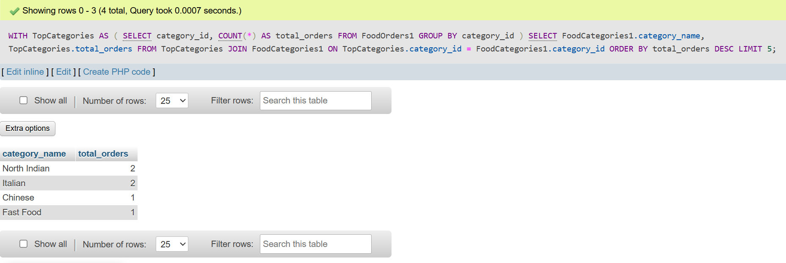

## <center><h1>ASSESMENT - 1 : SQL BASED </h1></center>

# SCENARIO - 4 : You are managing a food delivery database with three tables: orders (order_id, customer_id, restaurant_id, order_value), restaurants (restaurant_id, name, city,category), and customers (customer_id, name, area). A business team asks for a report showing every restaurant's name and total revenue, including restaurants that have not yet received any orders . 

**Question: Explain which SQL JOIN type must be used to include restaurants with zero orders and describe what would happen if an INNER JOIN were used instead. Justify your choice of join type in terms of how it handles unmatched rows between the two tables**

```
    CREATE TABLE Customers (
        customer_id INT PRIMARY KEY,
        name VARCHAR(50),
        area VARCHAR(50)
    );

    INSERT INTO Customers VALUES (1,'Rahul','Ahmedabad'), (2,'Priya','Rajkot'), (3,'Amit','Surat');

    CREATE TABLE Restaurants (
    restaurant_id INT PRIMARY KEY,
    name VARCHAR(100),
    category VARCHAR(50)
    );

    INSERT INTO Restaurants VALUES (101,'Dominos','Italian'), (102,'Subway','Fast Food'), (103,'BBQ Nation','North Indian'), (104,'Pizza Hut','Italian');

    CREATE TABLE Orders (
    order_id INT PRIMARY KEY,
    customer_id INT,
    restaurant_id INT,
    order_value DECIMAL(10,2)
    );

    INSERT INTO Orders VALUES (1,1,101,500),(2,2,101,700),(3,1,103,1200),(4,3,102,300);

    SELECT Restaurants.name, SUM(Orders.order_value) AS total_revenue FROM Restaurants LEFT JOIN Orders ON Restaurants.restaurant_id = Orders.restaurant_id GROUP BY Restaurants.restaurant_id, Restaurants.name;
```


## SCENARIO - 5 :You are working on a food delivery analytics dashboard. Management wants to rank all delivery agents within each city by their number of completed deliveries for the current month, and also display how each agent's count compares to the agent ranked directly above them in that city.

**Question :Identify the two SQL window functions you would use — one for ranking and one for retrieving the previous row's value — and explain why using window functions with PARTITION BY produces more accurate and maintainable results for this requirement than a GROUP BY with a self-join or correlated subquery approach.**

```
INSERT INTO DeliveryAgents VALUES (1,'Rahul','Ahmedabad',150), (2,'Priya','Ahmedabad',120), (3,'Amit','Ahmedabad',100), (4,'Karan','Rajkot',180), (5,'Neha','Rajkot',160);

SELECT agent_name, city, deliveries_completed, RANK() OVER( PARTITION BY city ORDER BY deliveries_completed DESC ) AS rank_no FROM DeliveryAgents;
```


```
SELECT agent_name, city, deliveries_completed, LAG(deliveries_completed) OVER( PARTITION BY city ORDER BY deliveries_completed DESC ) AS previous_agent_count FROM DeliveryAgents;
```


## SCENARIO - 6 :You are optimising a SQL report for a food delivery operations team. The report first identifies the top 5 restaurant categories by total order count, and then retrieves the full order details only for restaurants belonging to those top categories. A colleague has written this as a deeply nested subquery inside the WHERE clause.

**Question: Compare using a CTE (WITH clause) versus a nested subquery for this two-step requirement. Evaluate the trade-offs in terms of readability, ability to reuse the intermediate result, and debuggability. In what specific situation would you prefer the nested subquery over a CTE?**

```
CREATE TABLE FoodCategories1 (
    category_id INT PRIMARY KEY,
    category_name VARCHAR(50)
);

INSERT INTO FoodCategories1 VALUES
(1,'Italian'),
(2,'North Indian'),
(3,'Fast Food'),
(4,'Chinese');

CREATE TABLE FoodOrders1 (
    order_id INT PRIMARY KEY,
    category_id INT,
    order_amount DECIMAL(10,2)
);

INSERT INTO FoodOrders1 VALUES
(1,1,500),
(2,1,700),
(3,2,1200),
(4,2,800),
(5,3,300),
(6,4,450);

WITH TopCategories AS
(
    SELECT
        category_id,
        COUNT(*) AS total_orders
    FROM FoodOrders1
    GROUP BY category_id
)

WITH TopCategories AS ( SELECT category_id, COUNT(*) AS total_orders FROM FoodOrders1 GROUP BY category_id ) SELECT FoodCategories1.category_name, TopCategories.total_orders FROM TopCategories JOIN FoodCategories1 ON TopCategories.category_id = FoodCategories1.category_id ORDER BY total_orders DESC LIMIT 5;
```
