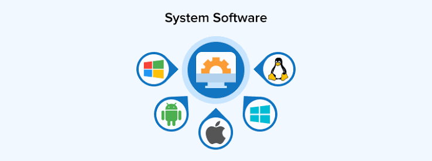
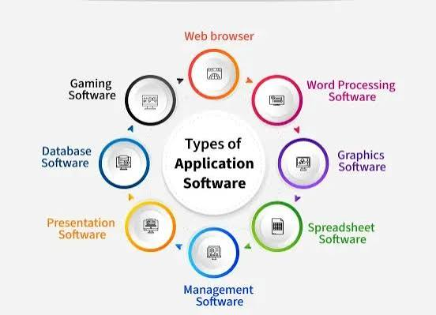
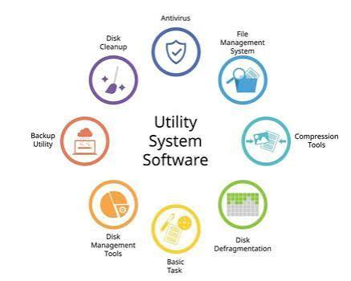
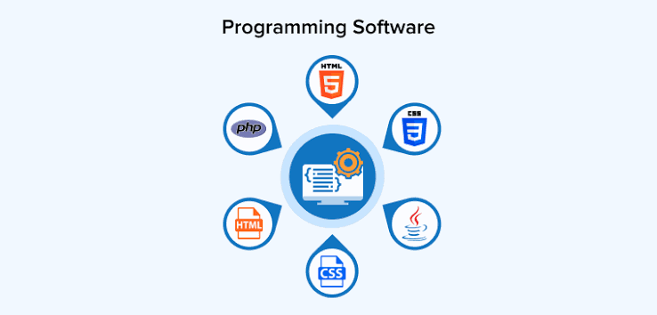

## 1-what is software list out all types of software

# definition :
            software is a set of instruction that tells computer hardware exactly what to do.

**Software translates human thoughts into a digital language (1s and 0s) that electronic chips can understand.**

Here is exactly how the layers of software stack on top of your physical computer hardware:

```text
┌────────────────────────────────────────┐
│        4. PROGRAMMING SOFTWARE          │  <-- Tools to build other apps
├────────────────────────────────────────┤
│        3. UTILITY SOFTWARE             │  <-- The cleanup and security crew
├────────────────────────────────────────┤
│        2. APPLICATION SOFTWARE         │  <-- Apps you open and use every day
├────────────────────────────────────────┤
│        1. SYSTEM SOFTWARE              │  <-- The foundation that runs the machine
├────────────────────────────────────────┤
│          COMPUTER HARDWARE             │  <-- The physical chips and wires
└────────────────────────────────────────┘
```

# The 4 main Types of software :-

## 1.system software (The Foundation) :
This software runs in background it manages your computer parts so the machine can stay turned on.

 **(i)OS(operating system):**  your device can not start without os.
'''
 * *EX:*
        windows,Androis,IOS,macos.
'''

 **(ii)Device Drivers:** Small translators that help the OS talk to external gadgets.
'''
 * *EX:*
        Printer driver, USB mouse driver
'''


       
## 2.Application Software (Everyday Apps) :
These are the regular programs you actively open and click on to do work or have fun.

 **(i)Web Browsers:** Apps used to surf the internet and view websites.
'''
 * *EX:*
        Google Chrome, Apple Safari.
'''

 **(ii)Productivity Apps:** Office or school tools used to type text or calculate numbers.
'''
 * *EX:*
        Microsoft Word, Google Sheets.
'''

 **(iii)Media & Entertainment:** Apps used to watch videos, stream music, or play games.
'''
 * *EX:*
        YouTube, Spotify, Netflix, Minecraft.
'''



## 3.UTILITY SOFTWARE (The Maintenance Crew) :
This software acts like a janitor. It cleans, fixes, and protects your system to keep it fast.

 **(i)Antivirus & Security :** Programs that catch and delete dangerous computer viruses.
'''
 * *EX:*
         Windows Defender, McAfee.
'''
 **(ii)File Compressors :** Programs that catch and delete dangerous computer viruses.
'''
 * *EX:*
         7-Zip, WinZip.
'''
 **(iii)Disk Cleaners:**Tools that look for useless junk files and throw them away. 
'''
 * *EX:*
          Windows Disk Cleanup, CCleaner.
'''




## 4.PROGRAMMING SOFTWARE (Tools for Developers)
Normal users do not open these. Software engineers use them to write code and build new apps.

 **(i)code Editors:**  Simple, clean notebooks where programmers type code.
'''
 * *EX:*
         Visual Studio Code (VS Code), Notepad++.
'''

 **(ii)Compilers & Interpreters:** Tools that translate human code into machine language (1s and 0s).
'''
 * *EX:*
         Python Interpreter, GCC Compiler.
'''

