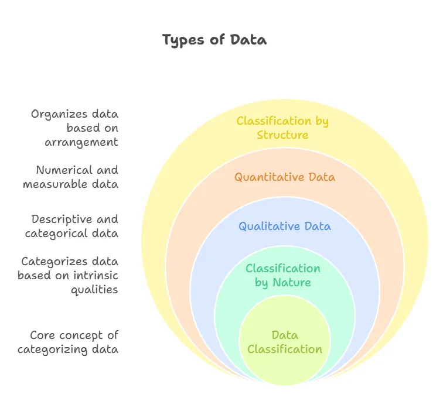

# what is data ? 

1. data is an collection information i.e called data 
2. data is an collection structured or unstructured types of data
3. data is also a raw formate i.e called data.

## types of data  

**there are 3 types of data**
1. structural categories data 
2. statistical categories data 
3. computational data types(in code)

# Comprehensive Guide to Data Types

## 1. Structural Categories of Data
In the modern tech world, data is categorized by how it is organized and stored:

*   **Structured Data**: Highly organized data that fits neatly into fixed rows and columns.
    *   *Where it is stored:* Relational Databases (SQL).
    *   *Examples:* Excel spreadsheets, phone books, airline reservation systems.
*   **Unstructured Data**: Data that has no predefined structure or organization, making it harder for computers to search and analyze.
    *   *Where it is stored:* NoSQL databases, data lakes, or file systems.
    *   *Examples:* Videos, audio files, PDF documents, emails, social media posts.
*   **Semi-Structured Data**: Data that does not fit into rigid tables but contains internal tags or markers to separate elements.
    *   *Where it is stored:* NoSQL databases, configuration files.
    *   *Examples:* JSON files, XML files, HTML source code.

---

## 2. Statistical Categories of Data
How data is classified based on its mathematical properties:

*   **Qualitative (Descriptive)**: Non-numerical data describing attributes.
    *   *Nominal:* Labels without order (e.g., eye color, nationality).
    *   *Ordinal:* Labels with a clear order or ranking (e.g., shirt sizes: S, M, L).
*   **Quantitative (Numerical)**: Numerical data that can be counted or measured.
    *   *Discrete:* Countable whole numbers (e.g., number of laptops).
    *   *Continuous:* Measurable values with infinite decimals (e.g., exact weight).

---

## 3. Computational Data Types (In Code)
How a code editor like VS Code interprets raw data values:

*   **Integer (`int`)**: Whole numbers (e.g., `42`).
*   **Float (`float`)**: Decimal numbers (e.g., `99.9`).
*   **String (`str`)**: Text values enclosed in quotes (e.g., `"Data Science"`).
*   **Boolean (`bool`)**: Logical flags (`True` or `False`).

