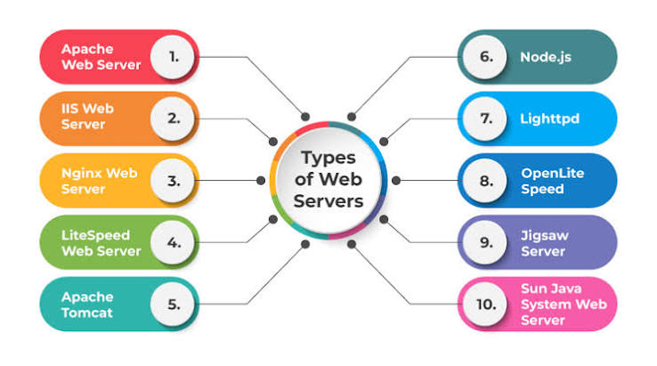
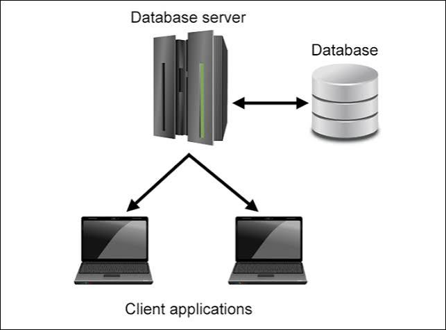
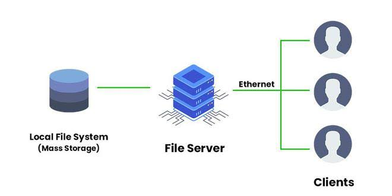
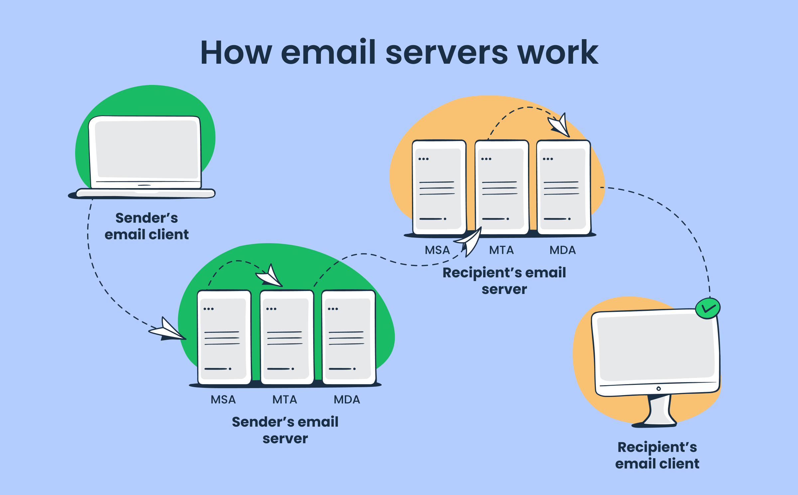
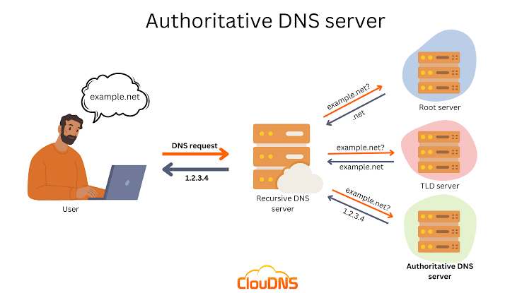

# Server

## Definition

A **server** is a computer or software system that provides services, data, resources, or applications to other computers or devices called **clients** over a network.

### Example

When you open a website:

* **Client:** Your web browser
* **Network:** Internet
* **Server:** Web server
* **Response:** Website files such as HTML, CSS, JavaScript, images, and videos

---

# What is a Web Server?

A **web server** is a computer or software that receives requests from web browsers and sends back website content using **HTTP** or **HTTPS** protocols.

### Example

```text
Browser
   ↓
Internet
   ↓
Web Server
   ↓
Website Files
   ↓
Browser

```


# Types of Servers

## 1. Web Server

A web server hosts and delivers websites and web applications.

### Examples

* Apache
* Nginx
* Microsoft IIS



---

## 2. Application Server

An application server runs application logic and business logic.

### Examples

* Node.js
* Apache Tomcat
* JBoss


---

## 3. Database Server

A database server stores and manages data.

### Examples

* MySQL
* PostgreSQL
* MongoDB
* Oracle



---

## 4. File Server

A file server stores and shares files over a network.

### Examples

* Windows File Server
* Samba
* FTP Server



---

## 5. Mail Server

A mail server sends, receives, and stores emails.

### Protocols

* SMTP
* IMAP
* POP3



---

## 6. DNS Server

A DNS server converts domain names into IP addresses.

### Example

google.com → IP Address



---