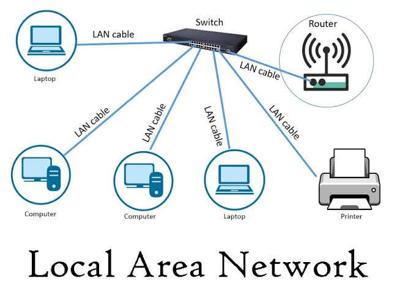
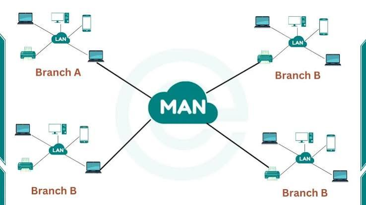
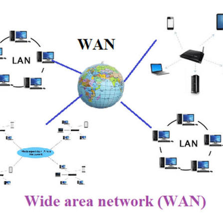

LAN, MAN AND WAN
================

1. LAN (LOCAL AREA NETWORK)
---------------------------

LAN is a network that connects computers and devices within a
small geographical area.



EXAMPLES:

* Home
* School
* Office
* Computer Lab

Example:
```
Computer 1 ───┐
              |
Computer 2 ───┼── Network
              |
Computer 3 ───┘

```
2. MAN (METROPOLITAN AREA NETWORK)
----------------------------------

MAN is a network that connects multiple LANs within a city or
large geographical area.



EXAMPLES:

* City-wide network
* University campus network
* Cable TV network


3. WAN (WIDE AREA NETWORK)
--------------------------

WAN is a network that connects computers and networks over a large
geographical area, such as different cities, countries, or the world.



EXAMPLES:

* The Internet
* Bank networks
* Global company networks


COMPARISON
==========
```
 
=================

LAN = Local Area Network

MAN = Metropolitan Area Network

WAN = Wide Area Network