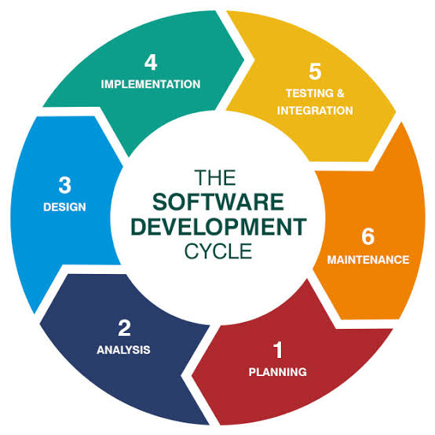
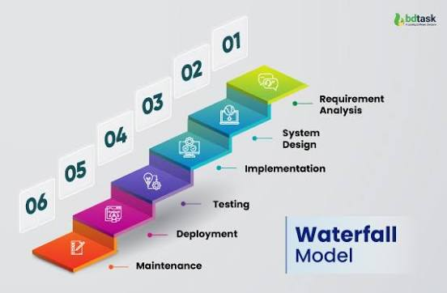
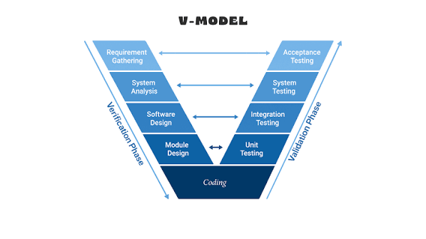
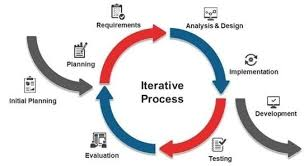
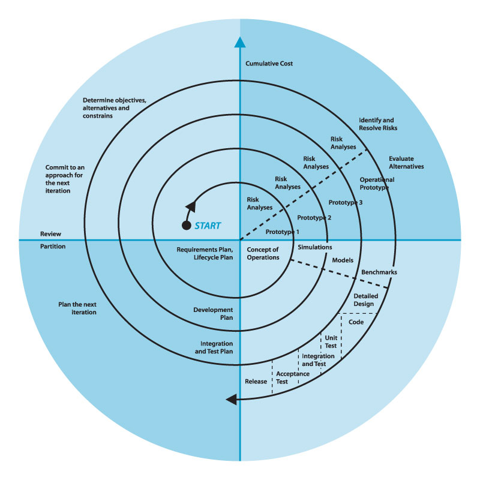
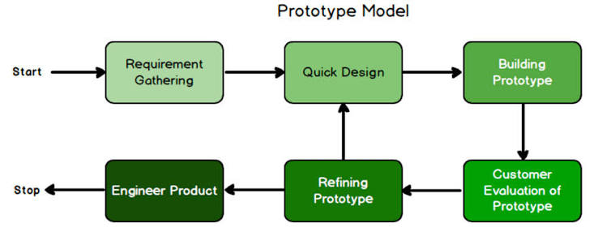

# SDLC (Software Development Life Cycle)

## Definition

**SDLC** stands for **Software Development Life Cycle**. It is a systematic process used to plan, design, develop, test, deploy, and maintain software.

---

# Main Phases of SDLC

1. **Planning** - Define the project goals and requirements.
2. **Requirement Analysis** - Understand what the customer needs.
3. **Design** - Create the software architecture and design.
4. **Development** - Write the program code.
5. **Testing** - Find and fix bugs.
6. **Deployment** - Release the software to users.
7. **Maintenance** - Update and improve the software.

---

# Types of SDLC Models

## 1. Waterfall Model

A sequential model where each phase is completed before the next phase begins.

**Example:** Government and large fixed-requirement projects.

---

## 2. V-Model

A development model where each development phase has a corresponding testing phase.

**Example:** Medical and safety-critical software.

---

## 3. Iterative Model

Software is developed and improved through repeated cycles.

**Example:** Software that is gradually improved over time.

---

## 4. Incremental Model

The software is developed and delivered in small parts called increments.

**Example:** First login, then payment, then reporting features.

---

## 5. Spiral Model

Combines iterative development with risk analysis.

**Example:** Large and high-risk software projects.

---

## 6. Prototype Model

A working model or prototype is created before developing the final software.

**Example:** Creating a demo to understand customer requirements.

---

## Simple Definition

**SDLC is a step-by-step process used to develop high-quality software from planning to maintenance.**